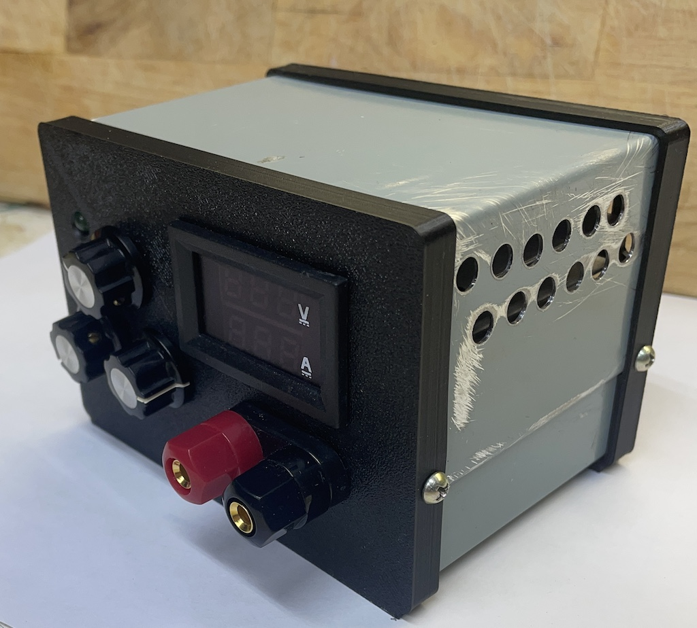

# How to make a project box

1mm thick sheet metal is good enough (rigid enough) for all reasonably sized project boxes.
Harvest from any home appliance that has metal sides. 

Assemble from two metal U-shaped parts. Top and bottom. The top part sides overlap the bottom part sides.
The top and bottom parts are held together by two sheet metal screws on each side.
The front and bottom panels are 3d printed plastic, with all the cutouts. 2mm thickness front, 1.5mm flanges
They overlap metal parts hiding metal cut-off edge imperfections.
Flanges are slotted to hold plastic better

Notice how sheet metal parts fit into the gaps. Notice different set-back at the top and bottom due to sheet metal overlap

Use a sheet metal screw with a pilot hole to hold it together. Drill the hole once the box is fully assembled, right through 
plastic-metal-metal-plastic.

# Result

## Metal cutting tips
Align unfolded U-shaped parts together, in one long pattern. So that once it is cut, their width is the same. This width is the depth of the box. 
The best way of cutting a straight line is to score hard and then bend/unbend until the metal breaks.
Handholding power sheers gives OK results. Depends on a steady hand and might be a 1mm deviation at best. Need to try to use a metal plate as a guide. It seems tricky, as the shear nose is round.

## Metal bending tips
When bending, align the bend line with the gap between hand brake plates. Move the top metal plate ~0.2-0.3mm away from the crack. Maybe use these printed dotted lines on the pattern, to know how much to move back?

## PCB mounting tips
Place PCB in the desired location, and mark holes on the bottom metal part with a marker. Drill. 
Expect the result to be off the holes in the PCB. Enlarge PCB holes to align the metal holes with a rotary tool.
Take a 6mm spacer with threads inside, and screw the PCB from the top to it, now PCB has tiny "legs". Use a short screw to leave 50% of the spacer empty on the inside. Use another short screw from the bottom of the box, to mount the whole PCB assembly through these legs. Two machine screws are facing each other.

Do a proper ribbon/wire connection from the main horizontal PCB to panel mounted vertical one, do not do pins and headers - the vertical board becomes wobbly. This is especially bad if the vertical board has potentiometers or buttons.

## PCB layout tips
Set back mounting holes 15mm away from edges, otherwise front/back plastic panel flanges conflict with bolt heads. Expect the holes to be enlarged manually later.
Leave enough space around ~ 10mm diameter restriction zone.

Position heatsinks and fans and ports/connectors before doing any trace routing. Make the fan blow air on them.

## Industry examples

