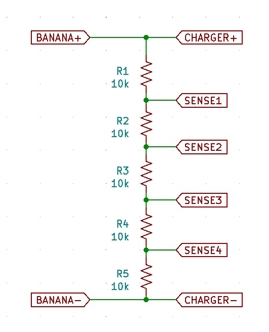
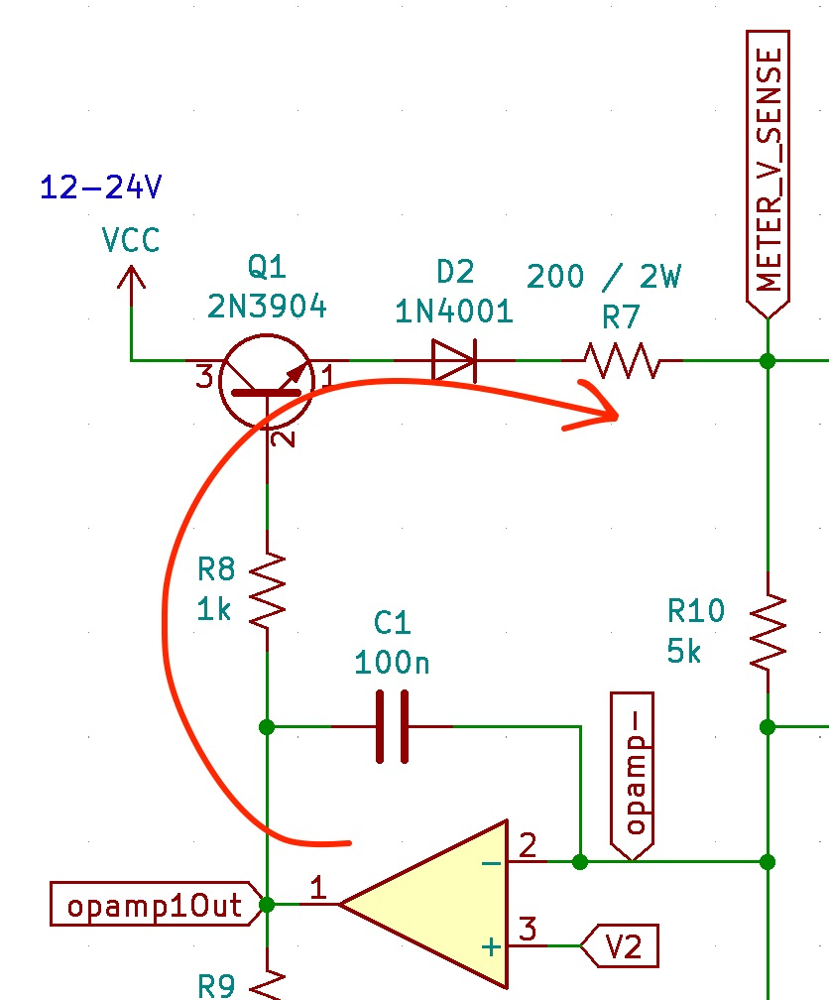
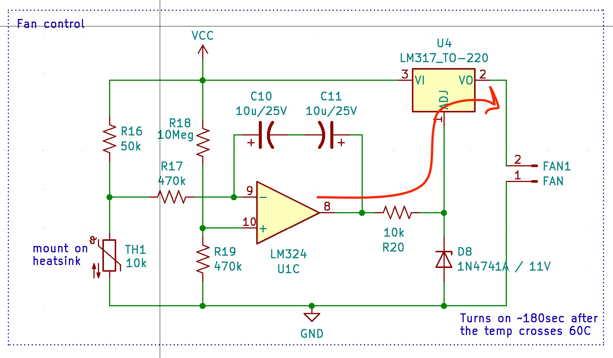
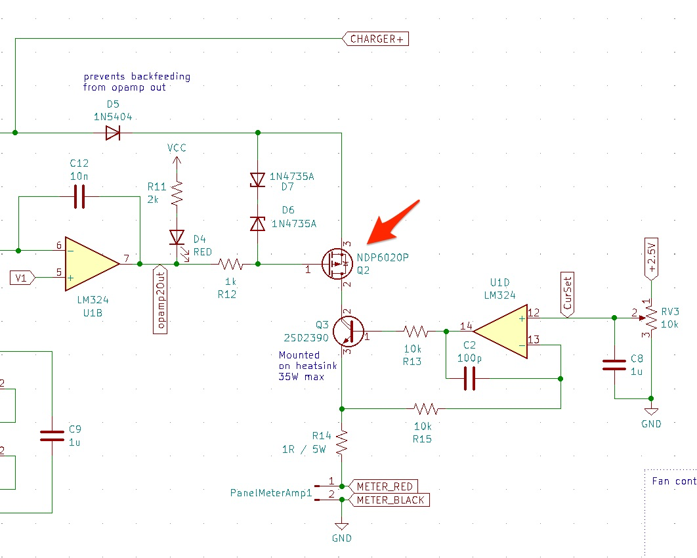
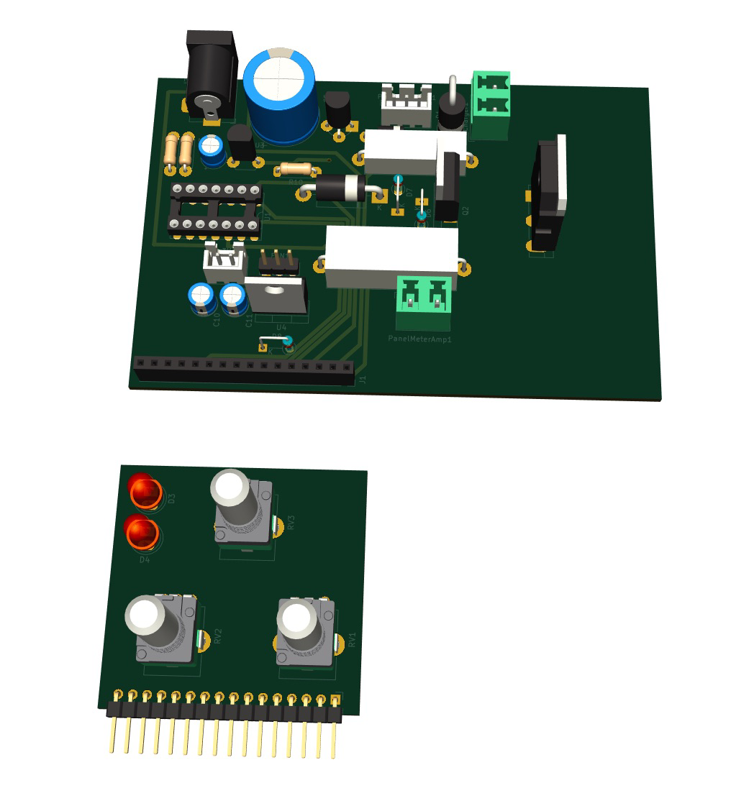
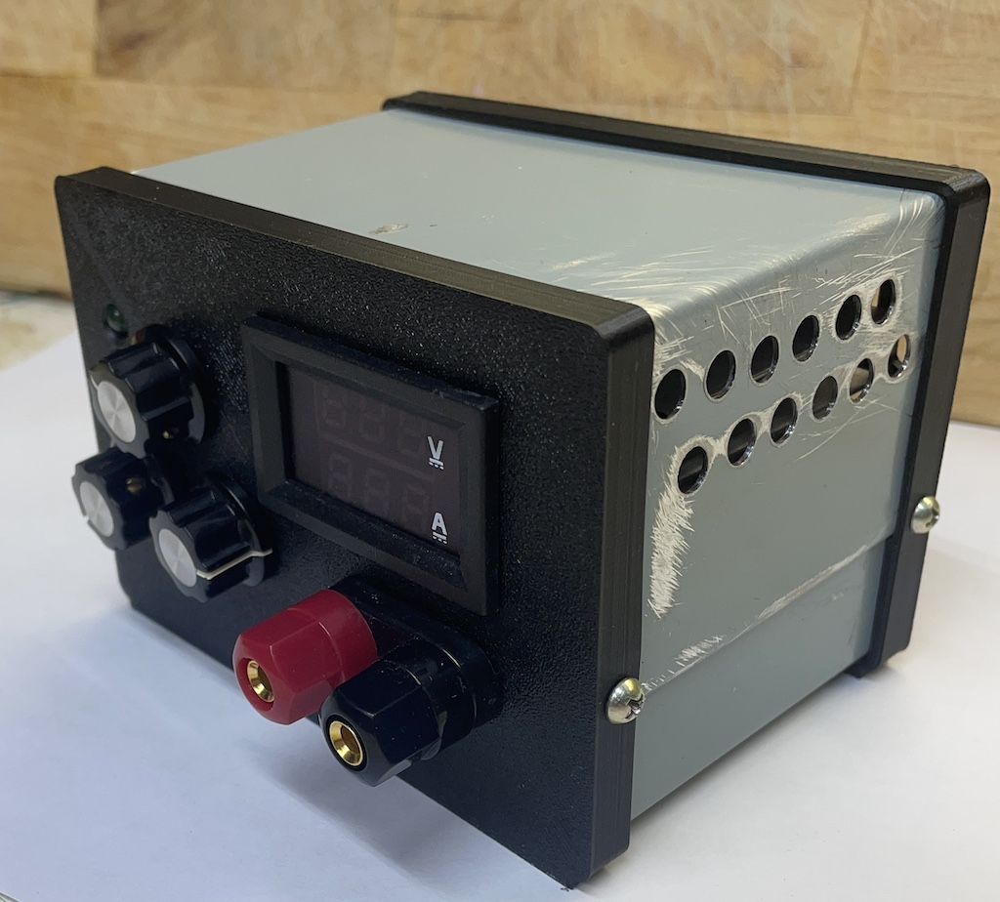

# Electronic battery simulator (also works as 35W electronic load)

## Description

Useful for testing battery chargers. 
Designed to use from single lithium batteries to 5S packs i.e. from 3.7V to 18V. Max charging current 2.3A 

Set the "battery" voltage with coarse/fine voltage pots, connect the charger and start the charging process. 
Adjust the "battery" voltage up/down to test how the charger responds. Set max allowed "charge" current with the current pot.

This device simulates battery discharging, current is limited by 200 Ohm resistors i.e. 60-120mA. When in "discharge" mode the
green LED is lit.
When the device simulates battery charging - the current is limited by both the internal charger circuitry and max allowed "charge" current. 
The absolute max is ~2.3A When in "charge" mode the red LED is lit.

A note on *S packs:
A typical pack charger senses the voltage across each battery in the pack. This is not implemented inside
but can be built as a pluggable add-on. One side plugs into the banana input of this electronic battery simulator, and the other side forms multiple voltage dividers, as many as the charger wants. Example

### Input voltage
Input voltage (VCC): 12-24V. The max "battery" voltage one can set is ~3V below this. 

* LM358 output swing from the top rail is 1.5V
* BJT voltage drop 0.7V
* Diode voltage drop 0.7V

Max voltage available to the cooling fan is ~2.75V below VCC. For the maximum cooling, VCC should be 14V+

* LM358 output swing from the top rail is 1.5V
* LM317 ADJ-to-out is 1.25V

### Charger voltage
Charger voltage 0-20V. This is limited by the MOSFET Vds

## Usage

Typical examples:

* manually increase the voltage to 4.2V and expect the lithium battery charger to stop
* manually limit/reduce the max allowed charging current, simulating increased battery resistance, and expect the charger to stop

Non-typical example:

* Set min "battery" voltage, apply external power, and use as a dummy load.

## Limits

Do not exceed 35W continuous heat dissipation. Pass BJT transistor will blow.

Do not exceed 20V charger voltage, switch MOSFET will blow.

Do not exceed 30V input voltage, opamps will blow.

## Fabrication

[LTSpice](ltspice)

[Schematic](schematic.pdf)

[Kicad](kicad)

[Enclosure](fusion360)

[Notes on fabricating metal enclosures](Metal%20enclosure%20project%20box.md)

Heatsink is not shown on the render below

## Notes

The main surprise is that this thing is as usable as a general-purpose dummy load as much as an electronic battery itself.

Do not make daughter boards that have buttons or pots. Mount them separately, and connect them with wires. It is wobbly, the daughter board needs to be secured to a vertical panel, while the vertical panel needs to be removable by design. Total PITA, don't do it again.

Despite PCB being sparsely populated, wires make the inside of the box very very crowded. Need to make the box deeper, +1-2-3 cm depth would not be noticeable but would make wire management easier.

Make the cooling fan blow air on the heat sink along the fins.

This can't be stressed enough - position all connectors, mounting holes and heatsink on the PCB before routing.

See [Notes on fabricating metal enclosures](Metal%20enclosure%20project%20box.md)

For a small enclosure like here, it takes longer to manufacture from metal than to 3D print.
